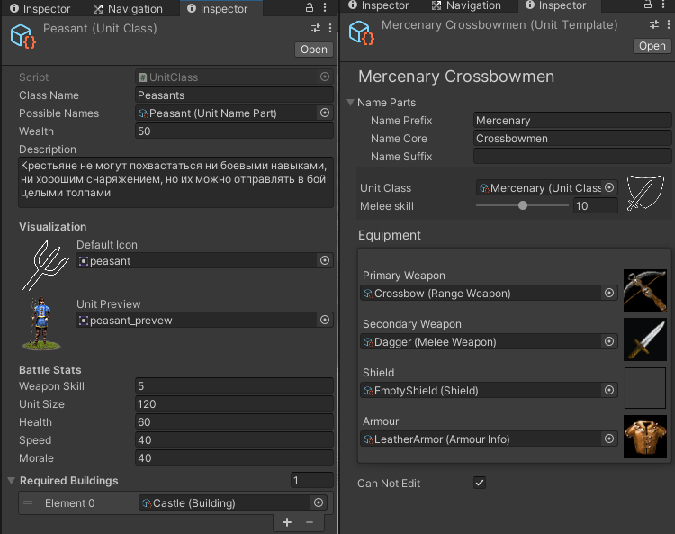
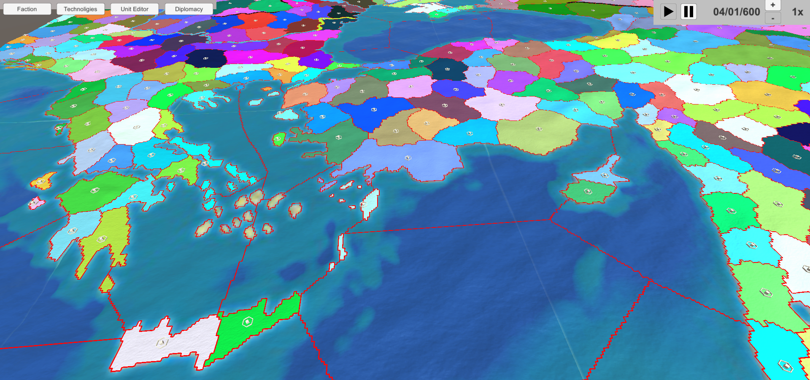

#### Краткое описание

Прототип глобальной стратегии в средневековом сеттинге. 
На данной момент включает в себя:
 - два варианта стратегической карты: сделаный вручную и сгенерированный на основе карты высот с разными механиками перемещения армий
 - конструктор юнитов и его взаимодействие с другими механиками: технологиями и строительством
 - систему шпионажа
 - прототип боевой системы
 - генератор карт для сражений

#### О коде
 - для связи классов используются scriptableobject'ы. Использование паттерна Singleton, статических свойств и методов сведено к минимуму.
 - небольшая база данных на scriptableobject'ах
 - реализован алгоритм поиска пути А*
 - довольно продвинутый вариант State machine, задающий поведения отрядов ИИ и игрока
 - версия Unity: 2020.3.18

#### Скриншоты

Инспекторы:

Пример генерации карты:

Прототип боевой системы:

Конструктор отрядов:

Конструктор названий для отрядов:

Вариант глобальной карты, с которого начался прототип:

