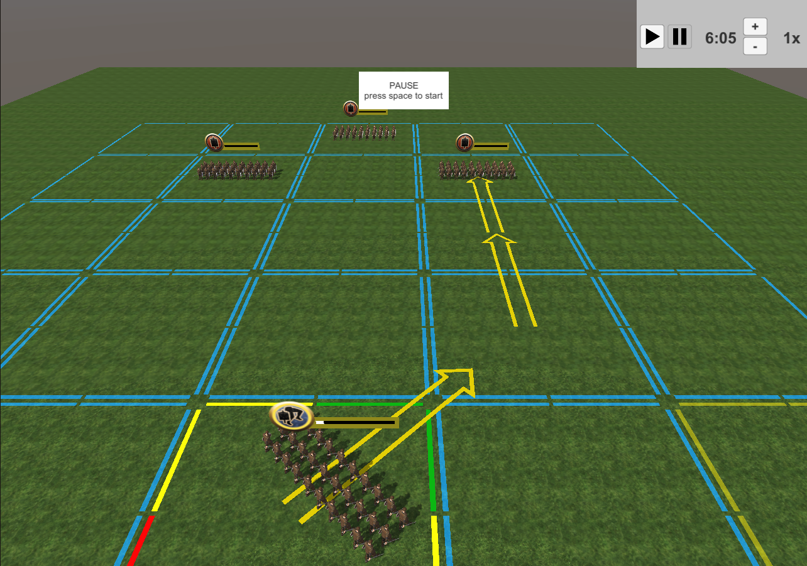
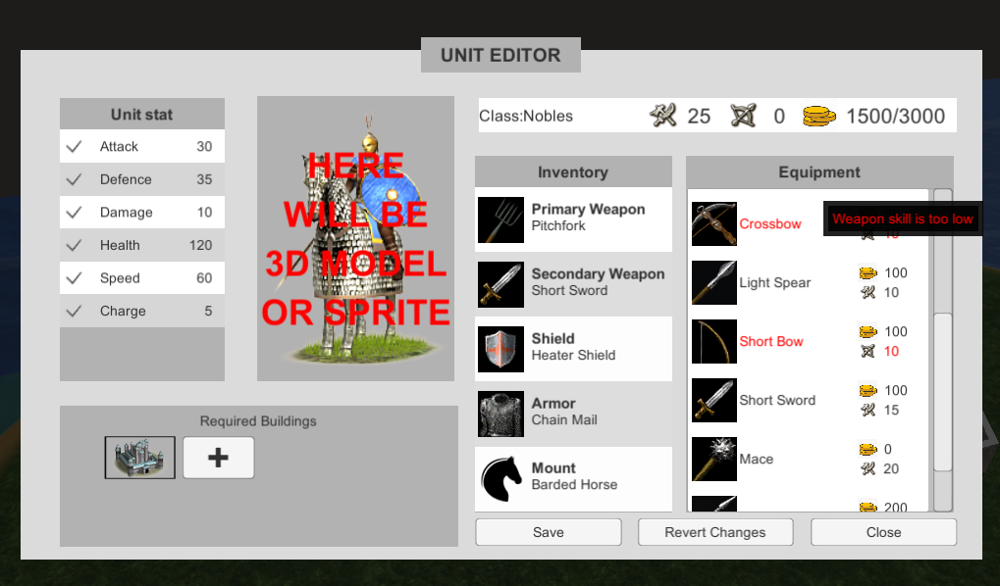
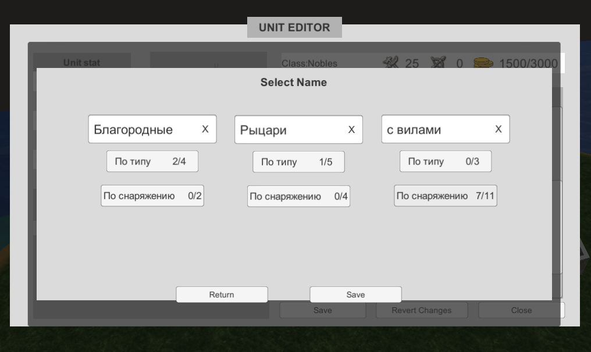
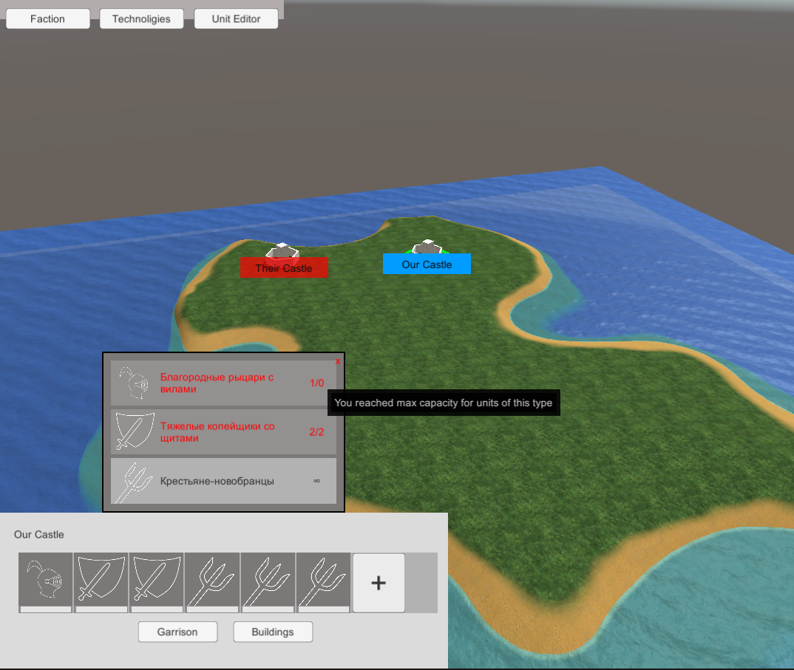

#### Краткое описание

Прототип глобальной стратегии. Мой текущий Pet project. 
На данной момент реализовано:
 - конструктор юнитов и его взаимодействие с другими механиками: технологиями и строительством
 - прототип боевой системы

#### О коде
 - для связи классов используются scriptableobject'ы. Использование паттерна Singleton, статических свойств и методов сведено к минимуму.
 - небольшая база данных на scriptableobject'ах
 - реализован алгоритм поиска пути А*
 - довольно продвинутый вариант State machine, задающий поведения отрядов ИИ и игрока

#### Скриншоты
<i>(Я не художник, поэтому интерфейс выполнен в стиле "50  оттенков серого")</i>

Сражения:

Конструктор отрядов:

Конструктор названий для отрядов:

Глобальная карта:
